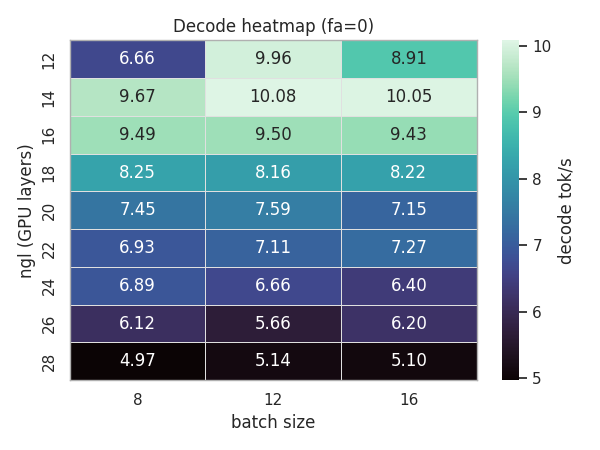
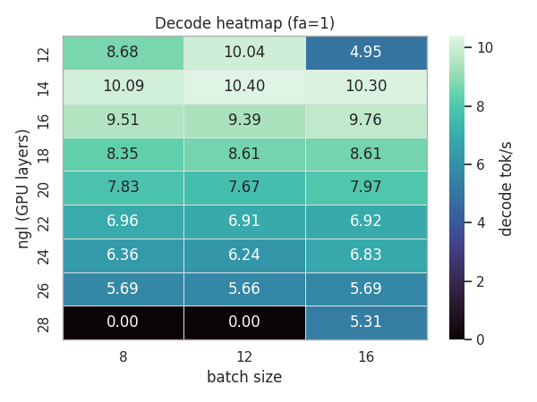
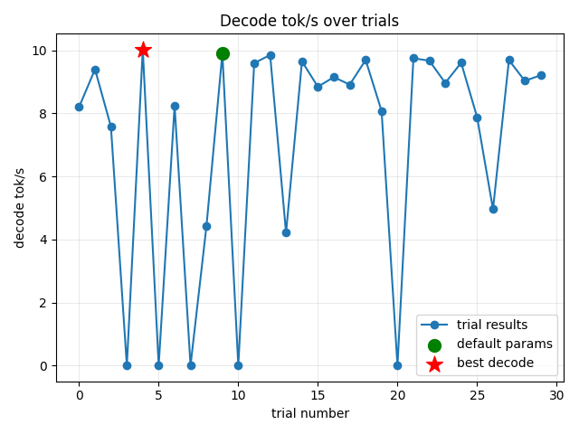
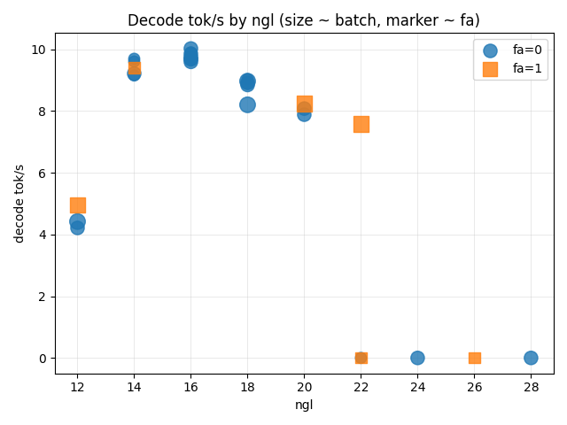

## llama-bench-tuner

llama.cpp の `llama-bench` をスクリプト経由で回し、グリッド探索や Optuna ベースのサーチ、可視化までをまとめて扱うためのツール群です。

---

## 機能

- **グリッドチューニング（`llama-tune`）** – `ngl`、`batch`、`flash-attn` の組み合わせを総当たりし、各実行の CSV/STDOUT を保存したうえで decode/prefill の tok/s を抽出し、タイムスタンプ付きのサマリーを出力します。
- **Optuna チューニング（`llama-tune-optuna`）** – Optuna の TPE サンプラー＋任意のプルーナーでハイパーパラメータを探索し、SQLite ストレージで再開可能。ベスト試行のメタデータと全試行の履歴を残します。
- **可視化ヘルパー** – サマリー CSV をランク表やプロット（`ngl` 別 decode トークン速度、試行の推移、散布図など）に変換し、ざっと傾向を把握できるようにします。

---

## 必要環境

- Python >= 3.10
- [llama.cpp](https://github.com/ggerganov/llama.cpp) からビルドした `llama-bench` バイナリ
- ベンチマーク設定に適合した GGUF モデル
- （任意）GPU ビルドに必要なドライバー／ツールチェーン

依存パッケージは [uv](https://github.com/astral-sh/uv) を利用してセットアップすることを推奨します（`pip` でも動作しますが、以下では uv ベースの手順を示します）。

---

## セットアップ

```bash
# uv が未導入ならインストール
curl -LsSf https://astral.sh/uv/install.sh | sh

# リポジトリ直下で開発環境構築
uv venv
source .venv/bin/activate
uv pip install -e .
```

インストールされるコンソールスクリプト:

| Script | Entry point | 目的 |
| --- | --- | --- |
| `llama-tune` | `llama_bench_tuner.tune:main` | グリッド探索ドライバー |
| `llama-tune-viz` | `llama_bench_tuner.viz:main` | グリッドサマリーの可視化 |
| `llama-tune-optuna` | `llama_bench_tuner.optuna_tune:main` | Optuna サーチドライバー |

生成物は既定で `outfile/`（RAW CSV、サマリー、プロット）および `tmp/`（stderr ログ）に出力されます。書き込み権限を確認してください。

---

## 使い方

### 1. グリッドチューニング（`llama-tune`）

```bash
llama-tune \
  --llama-bench /path/to/llama-bench \
  --model /path/to/model.gguf \
  --threads 14 \
  --prompt 2048 \
  --ngen 256 \
  --ngl 16 20 24 28 \
  --batch 8 12 \
  --flash-attn 0 1
```

GPT-OSS-120B 向けの探索レンジ例
------------------------------

2×RTX 6000 Ada 構成（単一ノード）で 120B クラスのモデルを扱う際は、メモリとスループットのトレードオフを把握するため、やや広めのレンジを総当たりします。

```bash
llama-tune \
  --llama-bench /path/to/llama.cpp/build/bin/llama-bench \
  --model /path/to/llama.cpp/models/gpt-oss-120b/gpt-oss-120b-mxfp4-00001-of-00003.gguf \
  --threads 14 --prompt 2048 --ngen 256 \
  --ngl 20 24 28 32 \
  --batch 6 8 10 12 \
  --flash-attn 0 1 \
  --ub-ratio 2.0 \
  --nkvo 0 \
  --split-mode layer
```

JSON で検索空間を外出しする場合は `--space-file` を利用できます。RTX 4000 Ada（20 GB）で GPT-OSS-120B を動かした例:

```jsonc
// infile/grid_space_rtx4000_gptoss120b.json
{
  "ngl": [12, 14, 16, 18, 20, 22, 24, 26, 28],
  "batch": [8, 12, 16],
  "flash_attn": [0, 1]
}
```

```bash
llama-tune \
  --llama-bench ... \
  --model ... \
  --threads 14 --prompt 2048 --ngen 256 \
  --space-file infile/grid_space_rtx4000_gptoss120b.json \
  --ub-ratio 2.0 --nkvo 0 --split-mode layer
```

上記レンジは RTX 4000 Ada（20 GB）のように GPU オフロード（`--split-mode layer` や `--nkvo 0`）を併用する構成で、おおむね 92 GB 未満の VRAM 使用量を想定した目安です。完全オン GPU の場合はより多くの VRAM を要するので、リソースに応じて `ngl` や `batch` を調整してください。より大容量 GPU なら `--ngl 34 36` を追加したり、リソースが限られる場合は `--batch` の候補を絞ってください。

出力:

- `outfile/bench_*` – llama-bench 実行ごとの RAW CSV
- `tmp/bench_*.stderr.txt` – stderr ログ（非空の場合）
- `outfile/summary_YYYYMMDD_HHMMSS.csv` – decode/prefill tok/s と各種フラグを統合したサマリー

CLI は decode tok/s（同率の場合は prefill tok/s）で最良構成を表示します。

#### サンプル: 2025-11-17_grid

- サマリ: `outfile/grid/20251117_224903/summary_20251117_224903.csv`
- 可視化: `outfile/grid/20251117_224903/viz/`
- ベスト構成: `ngl=14`, `batch=12`, `flash-attn=1`, decode **10.4 tok/s**, prefill 28.5 tok/s
- 既定コンボ（`ngl=16`, `batch=8`, `fa=0`）もサマリ内に含めてベースライン比較が可能

### 2. Optuna チューニング（`llama-tune-optuna`）

```bash
llama-tune-optuna \
  --llama-bench /path/to/llama-bench \
  --model /path/to/model.gguf \
  --ngl-min 16 --ngl-max 28 \
  --batch-min 8 --batch-max 16 \
  --flash-attn 0 1 \
  --n-trials 30 \
  --storage sqlite:///outfile/optuna_study.db \
  --study-name my_run \
  --seed 42
```

主な生成物:

- `outfile/optuna_best.json` – ベスト試行の値／パラメータ／メタ情報
- `outfile/optuna_trials.csv` – ユーザー属性（prefill tok/s やログパスなど）付きの全試行履歴

`--storage` と必要に応じて `--study-name` を再利用すれば途中から再開できます。

#### サンプル: 2025-11-19_optuna_seed42

- Storage: `sqlite:///outfile/optuna_study_seed42.db` / Study: `gptoss120b_seed42`
- 出力: `outfile/optuna/20251119_070656_gptoss120b_seed42/`
- ベスト構成: `ngl=16`, `batch=12`, `flash-attn=0`, decode **10.03 tok/s**
- `viz_optuna` は seeded default コンボを 1 点のみ緑でハイライトし、初期値が二重表示されません

### 3. 可視化（`llama-tune-viz` & `viz_optuna`）

グリッドサマリー:

```bash
llama-tune-viz --summary outfile/summary_20240101_120000.csv --outdir reports
```

Optuna サマリー:

```bash
python -m llama_bench_tuner.viz_optuna \
  --trials outfile/optuna_trials.csv \
  --best outfile/optuna_best.json \
  --outdir reports
```

どちらのコマンドも、ランク表や PNG プロット（decode vs `ngl`、試行推移、`ngl`×`batch` 散布図など）を指定ディレクトリに書き出します。

#### 可視化サンプル

- Grid 実行 (`2025-11-17_grid`): `reports/grid_sample/`
  - 
  - 
- Optuna 実行 (`2025-11-19_optuna_seed42`): `reports/optuna_sample/`
  - 
  - 

---

## Tips

- `--ub-ratio` でバッチサイズから自動的にマイクロバッチ（`ub = batch / ratio`）を算出できます。
- `--nkvo` や `--split-mode` を切り替えてオフロードや分割戦略を試すと挙動比較が簡単です。
- ハング対策として `--timeout-per-trial` を設定すると、タイムアウトした試行に 0 スコアを付け、Optuna が低優先に扱います。
- `rich` ログには各実行の結果やパース成否が表示されます。`ok=False` の場合は `tmp/` 以下の stderr ログを確認してください。

### WSL + 20 GB 級 GPU での落ちやすい条件

- Windows Subsystem for Linux 2 環境（特に RTX 4000 Ada など 20 GB VRAM クラス）では、`ngl=32` かつ `flash-attn=1` で `batch>=8`、もしくは `flash-attn=0` でも `batch>=12` といった重い設定を回すと、`CUDA error: unknown error / out of memory` を契機に WSL ごと GPU デバイスがリセットされることがあります。
- `llama-tune` は既定で上記レンジを自動スキップし、`--allow-wsl-unsafe` を付与したときのみ実行します。
- どうしてもその領域を試す場合は、Windows 側で TDR を延長する／`--split-mode layer` や `--nkvo 0` で CPU オフロードを増やす／バッチや `flash-attn` を落とす、などで VRAM 使用量を抑えてください。

---

## 開発メモ

開発が進んだら lint や test の実行方法を追記してください。Issue や PR も歓迎です。

## ライセンス

本ソフトウェアは [MIT License](./LICENSE) の下で公開しています。Copyright (c) 2025 [@kennel_org](https://x.com/kennel_org)
