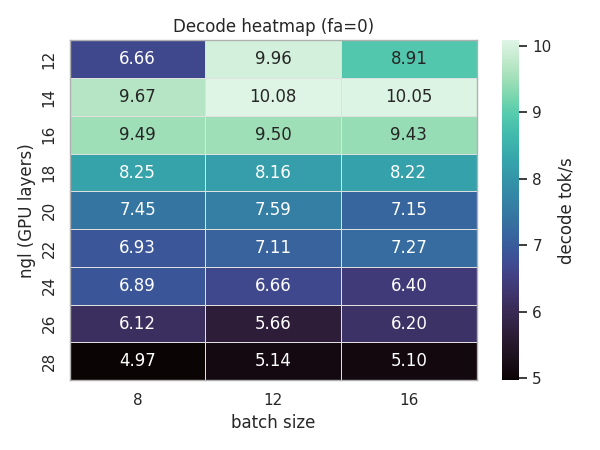
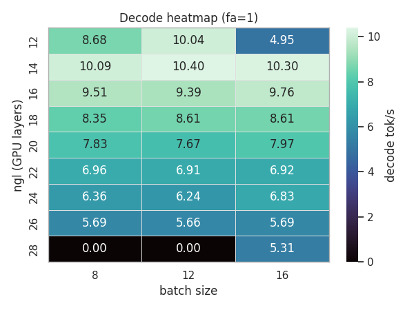
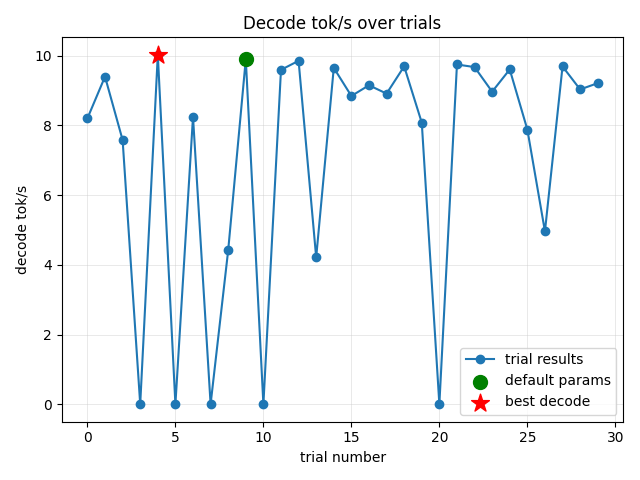
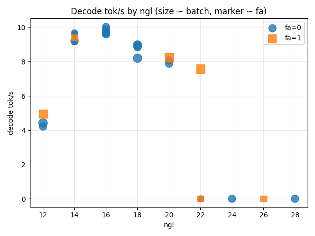

## llama-bench-tuner

Tools for scripting llama.cpp's `llama-bench` runs, exploring parameter grids or Optuna-driven searches, and generating quick visual summaries.

---

## Features

- **Grid tuning (`llama-tune`)** – iterate over `ngl`, `batch`, and `flash-attn` combinations, save each raw CSV/stdout, parse decode & prefill token-per-second metrics, and emit a timestamped summary table.
- **Optuna tuning (`llama-tune-optuna`)** – sample hyperparameters with Optuna, resume-able via SQLite storage, and capture top trial metadata plus the full trial ledger.
- **Visualization helpers** – convert summaries into ranked tables and plots suited for quick inspection of decode throughput.

---

## Requirements

- Python >= 3.10
- `llama-bench` binary from [llama.cpp](https://github.com/ggerganov/llama.cpp)
- GGUF model compatible with the chosen benchmark parameters
- Optional: GPU driver/toolchain needed by your llama.cpp build

We recommend installing dependencies via [uv](https://github.com/astral-sh/uv) (plain `pip` remains compatible, but instructions below assume uv).

---

## Setup

```bash
# install uv if you don't have it yet
curl -LsSf https://astral.sh/uv/install.sh | sh

# inside repo root
uv venv
source .venv/bin/activate
uv pip install -e .
```

The package installs five console scripts:

| Script | Entry point | Purpose |
| --- | --- | --- |
| `llama-tune` | `llama_bench_tuner.tune:main` | Grid search driver |
| `llama-tune-viz` | `llama_bench_tuner.viz:main` | Visualize grid summaries |
| `llama-tune-optuna` | `llama_bench_tuner.optuna_tune:main` | Optuna search driver |
| `llama-tune-viz-opt` | `llama_bench_tuner.viz_optuna:main` | Visualize Optuna summaries |
| `llama-tune-capabilities` | `llama_bench_tuner.capabilities:main` | Read-only `llama-bench --help` capability probe |

All generated artifacts default to the `outfile/` directory (raw CSVs, summaries, plots) and `tmp/` for stderr logs; ensure those paths are writable.

Before adding a non-legacy llama.cpp axis, record the installed binary's documented options:

```bash
llama-tune-capabilities --llama-bench /path/to/llama-bench --output outfile/capabilities.json
```

The Grid summary retains its original columns first. Additive metadata keeps requested
offload/placement separate from values actually reported by the native benchmark CSV.

---

## Usage

### 1. Grid tuning (`llama-tune`)

```bash
llama-tune \
  --llama-bench /path/to/llama-bench \
  --model /path/to/model.gguf \
  --threads 14 \
  --prompt 2048 \
  --ngen 256 \
  --ngl 16 20 24 28 \
  --batch 8 12 \
  --flash-attn 0 1
```

Example (from the GPT-OSS-120B debugging run):

```bash
llama-tune \
  --llama-bench /path/to/llama.cpp/build/bin/llama-bench \
  --model /path/to/llama.cpp/models/gpt-oss-120b/gpt-oss-120b-mxfp4-00001-of-00003.gguf \
  --threads 14 --prompt 2048 --ngen 256 \
  --ngl 16 20 24 28 \
  --batch 8 12 \
  --flash-attn 0 1
```

For a resumable run, provide a stable run directory. The runner writes
`checkpoint.json`, `run_metadata.json`, `run_result.json`, raw CSV files, and a
summary there, and overwrites the single checkpoint after each case:

```bash
llama-tune ... --run-dir outfile/grid/qwen27b_p40_gpu0
llama-tune ... --run-dir outfile/grid/qwen27b_p40_gpu0 --resume
```

Optional non-secret host labels can be supplied explicitly instead of guessing
GPU topology:

```bash
BENCH_HOST=x1ai BENCH_GPU=P40-0 BENCH_GPU_CONNECTION=OCuLink llama-tune ...
```

Typical GPT-OSS-120B search range
---------------------------------

For a single-node, 2×RTX 6000 Ada host used in our experiments, we sweep a slightly wider region to capture the memory/throughput trade-offs of 120B-sized models:

```bash
llama-tune \
  --llama-bench /path/to/llama.cpp/build/bin/llama-bench \
  --model /path/to/llama.cpp/models/gpt-oss-120b/gpt-oss-120b-mxfp4-00001-of-00003.gguf \
  --threads 14 --prompt 2048 --ngen 256 \
  --ngl 20 24 28 32 \
  --batch 6 8 10 12 \
  --flash-attn 0 1 \
  --ub-ratio 2.0 \
  --nkvo 0 \
  --split-mode layer
```

You can also externalize grid search spaces via `--space-file`. Example for running GPT-OSS-120B on a single RTX 4000 Ada (20 GB):

```jsonc
// infile/grid_space_rtx4000_gptoss120b.json
{
  "ngl": [12, 14, 16, 18, 20, 22, 24, 26, 28],
  "batch": [8, 12, 16],
  "flash_attn": [0, 1]
}
```

```bash
llama-tune \
  --llama-bench ... \
  --model ... \
  --threads 14 --prompt 2048 --ngen 256 \
  --space-file infile/grid_space_rtx4000_gptoss120b.json \
  --ub-ratio 2.0 --nkvo 0 --split-mode layer
```

The ranges above assume GPU offloading (e.g. `--split-mode layer`, `--nkvo 0`) to keep VRAM use below ~92 GB. Running fully on-GPU will consume more VRAM, so adjust `--ngl`/`--batch` accordingly. If you have extra headroom, extend `--ngl` to 34–36; if resources are tighter, narrow the batch list.

> Note: the GPT-OSS-120B MXFP4 model ships as three GGUF shards; point `--model` to the first shard (00001-of-00003) and keep the other files in the same directory so llama.cpp can stream them.


Outputs:

- `outfile/bench_*` – raw CSV dumps from llama-bench runs
- `tmp/bench_*.stderr.txt` – captured stderr per run (if non-empty)
- `outfile/summary_YYYYMMDD_HHMMSS.csv` – consolidated table with decode/prefill tok/s and flags

The CLI prints the best-performing configuration by decode tok/s (fallback to prefill tok/s for tie-breaking).

#### Sample run (2025-11-17_grid)

- Summary: `outfile/grid/20251117_224903/summary_20251117_224903.csv`
- Visuals: `outfile/grid/20251117_224903/viz/`
- Best config: `ngl=14`, `batch=12`, `flash-attn=1`, decode **10.4 tok/s**, prefill 28.5 tok/s
- Baseline (`ngl=16`, `batch=8`, `fa=0`) is included in the summary for quick regressions checks

### 2. Optuna tuning (`llama-tune-optuna`)

```bash
llama-tune-optuna \
  --llama-bench /path/to/llama-bench \
  --model /path/to/model.gguf \
  --ngl-min 16 --ngl-max 28 \
  --batch-min 8 --batch-max 16 \
  --flash-attn 0 1 \
  --n-trials 30 \
  --storage sqlite:///outfile/optuna_study.db \
  --study-name my_run \
  --seed 42
```

Key artifacts:

- `outfile/optuna_best.json` – best trial value/params/metadata
- `outfile/optuna_trials.csv` – full trial history, including user attrs for later analysis

Resume tuning by reusing the same `--storage` and optionally `--study-name`.

#### Visualization sample outputs

- Grid run (`2025-11-17_grid`): see `reports/grid_sample/`
  - 
  - 
- Optuna run (`2025-11-19_optuna_seed42`): see `reports/optuna_sample/`
  - 
  - 
- `viz_optuna` plots highlight the seeded default combo exactly once (no duplicated “initial value” markers)

### 3. Visualization (`llama-tune-viz` & `viz_optuna`)

Grid summaries:

```bash
llama-tune-viz --summary outfile/summary_20240101_120000.csv --outdir reports
```

Optuna summaries:

```bash
python -m llama_bench_tuner.viz_optuna \
  --trials outfile/optuna_trials.csv \
  --best outfile/optuna_best.json \
  --outdir reports
```

Both commands emit ranking CSVs and PNG plots (decode vs. `ngl`, trial progression, scatter maps) into the chosen output directory.

---

### 4. Context-capacity pipeline (`llama-tune-capacity`, `llama-tune-pipeline`)

The legacy `llama-tune` / `llama-tune-optuna` search `ngl x batch x flash-attn` at one prompt length. The pipeline answers a
different question: **how long a context stays practical on this host/model/runtime**, then tunes inside that boundary.

```
capacity  ->  grid  ->  optuna  ->  validate  ->  profile (FAST / BALANCED / LONG-CONTEXT) + Pareto tables
```

| stage | what it does | output |
|---|---|---|
| `capacity` | one `llama-bench` process per (KV type, depth); classifies `success / oom / runtime_abort / timeout / unsupported / slowdown / skipped_after_fail / gpu_busy`; separates the **capacity boundary** (completes) from the **practical-candidate boundary** (tg/pp ratio vs depth 0, minimum tg, VRAM headroom, wall time) | `capacity.json`, `capacity.csv` |
| `grid` | coarse Grid (batch, ubatch, flash-attn, ngl, n_cpu_moe, ...) only over what capacity says can run; reports per-axis effects, OOM/VRAM cliffs and a narrowed `next_space` | `grid.json`, `grid.csv` |
| `optuna` | one study per target depth. Default: multi-objective NSGA-II over tg↑ pp↑ TTFT↓ VRAM↓ wall↓. `--mode score:fast\|balanced\|long` gives a single-objective use-case score with real `trial.report` pruning | `optuna/d<N>/optuna.json`, `optuna_rows.csv`, `study.db` |
| `validate` | top-K candidates re-measured `--validate-reps` times as separate processes at 8K/32K/64K/128K; median / IQR / CV; a depth is `practical` only if every repeat completed and was stable | `validation.json`, `validation.csv` |
| `profile` | picks FAST / BALANCED / LONG among *practical validated* entries; writes the exact `llama-server` command, expected pp/tg/VRAM/RAM, commit and model identity; plus per-depth Pareto tables and a failure summary | `profiles/*.json`, `pareto/`, `failure_summary.json` |

```bash
uv run llama-tune-pipeline all \
  --llama-bench /path/to/llama-bench --model /path/to/model.gguf --name my-run \
  --gpu-index 0 --min-free-vram-gib 17 --wait-for-gpu --gpu-wait-timeout 3600 \
  --depths 0,4k,8k,16k,32k,64k,128k --kv f16,q8_0,q4_0 \
  --grid-depths 8k,32k --optuna-depths 32k,128k --trials 14 \
  --validate-depths 8k,32k,64k,128k --validate-reps 3 --top-k 4
# stages can also be run alone: llama-tune-pipeline capacity|grid|optuna|validate|profile ...
# interrupted? rerun the same command with --resume (finished stages are skipped, others continue from their checkpoint)
```

`llama-tune-capacity` runs only the first stage with its own `--run-dir`/`--resume`/`--dry-run`.
Outputs go to `<out-dir>/pipeline/<name>/{capacity,grid,optuna,validation,profiles,pareto}`.
A complete sample (pr36 / RTX 4000 Ada / 27B IQ4_XS) is in `reports/pipeline_pr36_swift15_2026-10-01/`.

Design rules worth knowing:

* **Nothing is guessed.** VRAM/RAM/clock/power values are `null` when the host offers no sampler (NVIDIA incl. WSL and AMD sysfs
  are supported). Options absent from `llama-bench --help` are recorded as `unsupported`, not executed. TTFT is an *estimate*
  from pp (`ttft_kind=estimated_from_pp`); `llama-bench` does not report it.
* **Multi-GPU hosts must be explicit**: pass `--gpu-index` (or `--min-free-vram-gib` to pick one) so single-GPU results are
  never mixed with dual-GPU ones.
* **GPU busy handling never touches other processes**: `--min-free-vram-gib`, `--wait-for-gpu`, `--gpu-wait-timeout`;
  if the GPU never frees up the stage stops with exit code 3 and can be resumed.
* **HIP/ROCm hardware exceptions are `runtime_abort`, not OOM.**
* Optuna cannot use `trial.report()` / `should_prune()` in multi-objective studies, so the multi-objective mode prunes with a
  cheap depth-0 stage (`PrunePolicy`); cheap metrics are kept separate from final metrics.
* The legacy CLIs and their CSV columns are unchanged; pipeline results use a separate schema (`PIPELINE_RESULT_FIELDS`).

### 5. Server-based measurements: real TTFT, speculation (MTP), soak (`server`, `soak` stages)

`llama-bench` has no TTFT and no speculative-decoding option, so two optional stages run the **real `llama-server` from a
profile's own command** (the `llama-server` binary must sit beside `llama-bench`). They annotate the profile JSON; they never
re-choose it.

```bash
# measured TTFT / pp / tg at several prompt sizes; add --spec-compare to also try --spec-type draft-mtp
uv run llama-tune-pipeline server --llama-bench ... --model ... --name my-run --gpu-index 0 \
  --server-sizes 4k,16k,32k --server-reps 3 --spec-compare
# long decode with GPU time series (temperature, SM clock, power, throttle reasons) and an explicit verdict
uv run llama-tune-pipeline soak --llama-bench ... --model ... --name my-run --gpu-index 0 \
  --soak-profile long --soak-minutes 20 --soak-window 30
```

* Prompts are unique per request, tokenizer-calibrated and sent with `cache_prompt:false`, so TTFT is not understated by
  prefix-cache reuse. Rows are `benchmark_kind=server`, `ttft_kind=measured`.
* **Speculation:** only offered if `llama-server --help` lists the `--spec-type`; a model without a usable MTP head is reported as
  `inactive`/`failed_to_start`. A `llama_server_mtp` command is added to the profile only if every size gains >= 10 %.
  The measurement prompt asks the model to count (highly predictable text), so **acceptance and speed-up are an upper-bound style
  estimate for this synthetic workload, not a promise for chat/coding traffic.**
* **Soak verdict** (`pass`) requires: no thermal / power-brake throttle bit (`sw_power_cap` alone is not thermal), SM clock drop
  <= 10 % and decode-speed drift >= -10 % between the first and last windows. Without GPU telemetry the verdict is speed-only
  and says so (`telemetry_available: false`).

## Tips

- Use `--ub-ratio` to derive micro-batch (`ub`) automatically from batch size (`batch / ratio`).
- Enable/disable `--nkvo` or `--split-mode` to test offloading and weight split strategies.
- Configure `--timeout-per-trial` when runs can hang; failed trials are scored as zero, so Optuna will deprioritize them.
- Rich logging highlights each run and reports whether parse/metrics succeeded; inspect `tmp/` stderr logs when `ok=False`.

---

## Development

For linting or tests, extend this section as workflows grow. Contributions welcome via issues or PRs.

## License

Released under the [MIT License](./LICENSE). Copyright (c) 2025 [@kennel_org](https://x.com/kennel_org).
